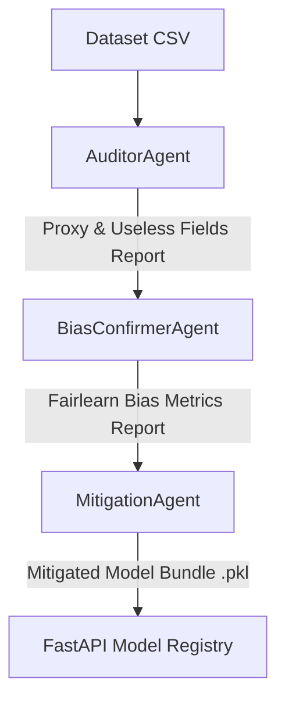

# AutoDetecter: AI Fairness Audit & Mitigation Pipeline

AutoDetecter is a modular, AI-powered system designed to audit datasets for bias, detect useless or sensitive proxy columns, and apply mitigation algorithms to train fair machine learning models. 

Built using the **Agent Development Kit (ADK) 2.2.0** and **Fairlearn**, the system exposes its functionality via a production-ready **FastAPI** service with dynamic, zero-restart model caching.

---

## 🏗️ Architecture & Agent Workflow

The auditing and mitigation pipeline operates as a directed workflow of three cooperative agents powered by the Gemma model:



1. **`AuditorAgent`**: Performs statistical scans (Cramér's V, Normalized Mutual Information, and outcome imbalance) to identify constant, identifier, or proxy columns.
2. **`BiasConfirmerAgent`**: Computes Fairlearn fairness metrics (Demographic Parity Difference, Equalized Odds Difference, and Disparate Impact Ratio) across the identified sensitive subgroups.
3. **`MitigationAgent`**: Applies mitigation techniques (e.g., column dropping and `ExponentiatedGradient` in-processing reductions), trains candidate models, and exports the best-performing fair model.

---

## ⚡ Key Features

* **Optional Predictions (`pred_col`)**: If predictions are not supplied, the pipeline automatically trains a baseline classifier to audit raw datasets (AutoML mode).
* **Deterministic Predictions**: Fairlearn's `ExponentiatedGradient` is a randomized classifier. AutoDetecter automatically handles and stabilizes predictions at inference time using a deterministic seed (`random_state=42`).
* **Hot-Reloadable Model Cache**: The FastAPI application uses low-overhead file metadata checks (`os.path.getmtime`) to reload updated pickle files instantly on the next API request without restarting the server.
* **Modular FastAPI Directory Layout**:
  ```bash
  app/
  ├── __init__.py
  ├── main.py                # App aggregator and lifespan events
  ├── state.py               # Time-based in-memory model cache
  ├── controllers/
  │   ├── mitigation_controller.py
  │   └── prediction_controller.py
  └── routes/
      ├── mitigation.py
      └── prediction.py
  ```

---

## 🚀 Setup & Installation

### 1. Install Dependencies
Make sure you have `uv` or `pip` installed:
```bash
# Using uv (Recommended)
uv pip install -r requirements.txt

# Or standard pip
pip install -r requirements.txt
```

### 2. Configure Environment
Create a `.env` file in the root directory:
```env
GEMINI_API_KEY=your_gemini_api_key_here
```

---

## 💻 How to Run

### Run the Pipeline CLI (Adult Dataset Demo)
Verify the agent pipeline end-to-end using the UCI Adult Census Income dataset:
```bash
python run_pipeline.py
```
This output is saved to `bias_pipeline_output/fair_adult_model.pkl`.

### Run the FastAPI Server
Start the API server locally:
```bash
python app.py
```
The server will start at `http://localhost:8000`. You can access the interactive Swagger documentation at `http://localhost:8000/docs`.

---

## 🔗 API Endpoints

### 1. Run Mitigation
* **Endpoint**: `POST /run-mitigation/`
* **Description**: Triggers the ADK workflow to audit and mitigate a dataset.
* **Payload**:
```json
{
  "dataset_path": "dataset/adult.csv",
  "label_col": "income",
  "pred_col": null,
  "output_filename": "fair_adult_model.pkl"
}
```

### 2. Predict Fair Outcome
* **Endpoint**: `POST /predict/`
* **Description**: Serves deterministic, mitigated predictions from the requested model.
* **Payload**:
```json
{
  "features": {
    "age": 39,
    "workclass": "State-gov",
    "education": "Bachelors",
    "marital-status": "Never-married",
    "occupation": "Adm-clerical",
    "relationship": "Not-in-family",
    "race": "White",
    "sex": "Male",
    "capital-gain": 2174,
    "capital-loss": 0,
    "hours-per-week": 40,
    "native-country": "United-States"
  },
  "model_filename": "fair_adult_model.pkl"
}
```

---

## 💡 Future Recommendations

1. **Dashboard UI (Streamlit or Gradio)**:
   Build a visualization dashboard showing the **Pareto frontier** of Accuracy vs. Fairness (Demographic Parity Difference) for all models trained during the mitigation phase. This helps developers choose the optimal model depending on corporate compliance requirements.

2. **Bias Drift Monitoring**:
   In production, the demographic distributions of users making prediction requests may drift over time. Create an endpoint that tracks the rolling Demographic Parity Difference on input features to trigger alerts when bias shifts.

3. **Multi-Feature Mitigation**:
   Extend the mitigation tool to accept multiple sensitive features simultaneously (e.g., both `race` and `sex`), enforcing joint demographic constraints.
